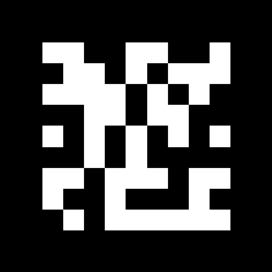

# Distance Meter - (Alvar Tags)

## Description
Measure distance between two objects using [alvar tags](http://wiki.ros.org/ar_track_alvar). Alvar tags used are the same size with different data so they can be distinguished from each other.

## Prerequisites

To install ar_track_alvar for ROS Noetic.
Clone repository inside `${workspace}/src`
```bash
git clone https://github.com/machinekoder/ar_track_alvar.git -b noetic-devel
```
Then build by running
```bash
catkin_make
```

## Generate Tags
To generate a tag use `ar_track_alvar` package as follows
```bash
rosrun ar_track_alvar createMarker -1 "${Data}"
```
The result will be something like this



Then Move generated markers to `markers` folder


